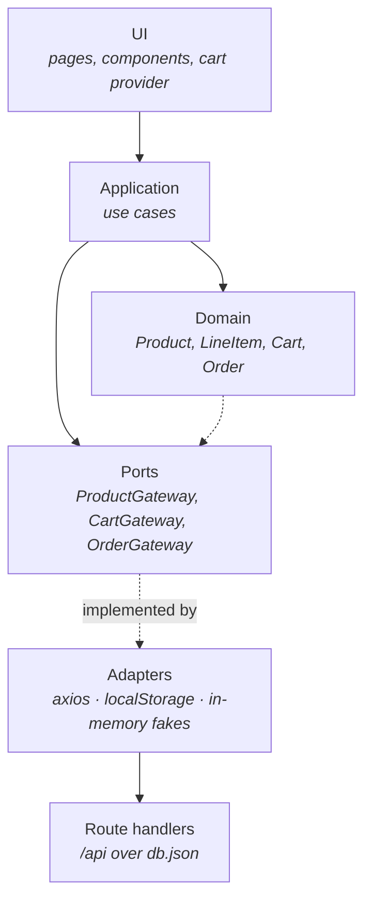

# Ecommerce Clean Architecture

A small storefront — browse products, fill a cart, check out — built to show Clean Architecture
and SOLID applied to a real Next.js application rather than to a diagram.

The interesting part is not the store. It is that the business rules do not know Next.js, axios
or `localStorage` exist, and that every layer is covered by tests that run in under a second.

```bash
yarn install
yarn dev        # http://localhost:3000
yarn test
```

## Architecture



Dependencies only ever point inward. `domain` imports nothing, `application` imports only
`domain`, and `infra` exists to satisfy interfaces the domain declared. The arrow from the
adapters back to the ports is the dependency inversion that makes the core testable: swapping
axios for an in-memory fake is a constructor argument, not a refactor.

```
src/@core/                        the part that would survive dropping Next.js
  domain/entities/                business rules and invariants
  domain/gateways/                ports the application depends on
  application/                    use cases, one file per intent
  infra/gateways/                 adapters implementing the ports
  infra/mappers.ts                anti-corruption between wire format and entities
  infra/container-registry.ts     composition root (inversify)

src/server/db.ts                  development datastore over db.json
src/app/api/                      route handlers — the backend the adapters call
src/app/                          pages and client components
src/contexts/cart.provider.tsx    React state on top of the cart use cases
```

## How a checkout travels through the layers

1. `CartPanel` calls `checkout` from the cart context.
2. `CheckoutUseCase` reads the cart through `CartGateway`, builds an `Order` — whose constructor
   refuses an empty cart or a blank card — and hands it to `OrderGateway`.
3. `OrderHttpGateway` serializes the entity into the API's wire format and POSTs it.
4. The route handler validates the payload, masks the card and appends the order to `db.json`.
5. Only once the order comes back does the use case clear the cart.

Nothing above step 3 knows an HTTP call happened.

## Decisions worth explaining

**The cart groups by product.** Adding the same product twice raises a `LineItem` quantity
instead of appending a duplicate. `LineItem` is immutable, so `decrement()` on a single unit
throws rather than producing a zero-quantity line, and `Cart` drops the line instead.

**`CartGateway` is synchronous.** The cart lives in one browser session and the only adapter is
`localStorage`. Promising asynchrony would buy nothing and would leak into every caller.

**The API is Next route handlers, not a separate server.** One process to run, and the handlers
can be invoked directly from tests. The adapters still talk to them over HTTP, so the core keeps
believing it is calling a remote service.

**Card numbers are never persisted.** The route handler validates the number, then stores only
the last four digits. The domain requires a non-empty card string; it does not care that what
comes back from storage is masked.

**Entities are serialized explicitly.** Handing an entity to axios would ship its internal
`props` wrapper and pin the API contract to the domain's shape. `infra/mappers.ts` owns that
translation in both directions, and drops catalogue fields the domain does not model.

## Tests

`yarn test` runs both suites; they share the same runner and no server needs to be up.

**Unit** — entities and their invariants, use cases against in-memory fakes, and adapters
against a stubbed axios instance.

**Integration** — the container resolving the whole dependency graph, the cart round-tripping
through real `localStorage`, the route handlers against a throwaway `db.json`, and a checkout
that crosses every layer at once. That last one uses an axios adapter
(`test/api-adapter.ts`) that dispatches to the route handler functions in-process, so the test
exercises the real gateways and the real API without booting a server.

## Scripts

| Command                             | What it does                |
| ----------------------------------- | --------------------------- |
| `yarn dev`                          | development server          |
| `yarn build` / `yarn start`         | production build and server |
| `yarn test` / `yarn test:watch`     | unit and integration tests  |
| `yarn typecheck`                    | `tsc --noEmit`              |
| `yarn lint`                         | ESLint                      |
| `yarn format` / `yarn format:check` | Prettier                    |

Set `NEXT_PUBLIC_API_URL` to point the adapters at a different API. Server-side rendering needs
an absolute URL, so it defaults to `http://localhost:$PORT/api`, while the browser uses `/api`.

`db.json` is a development datastore rewritten on every order, and it is not concurrency safe.
